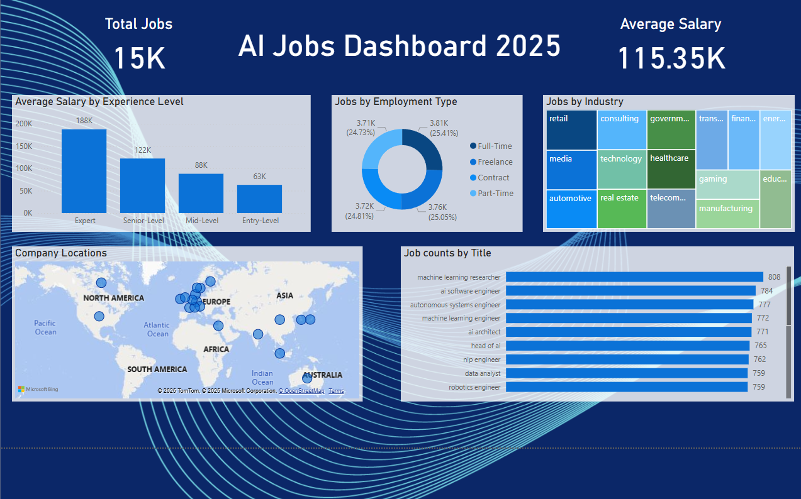
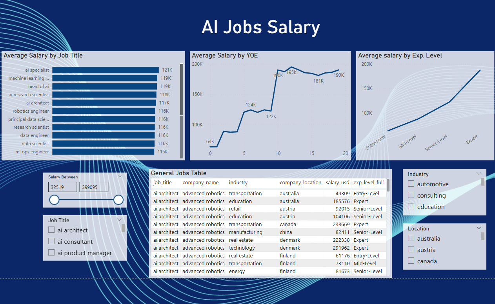
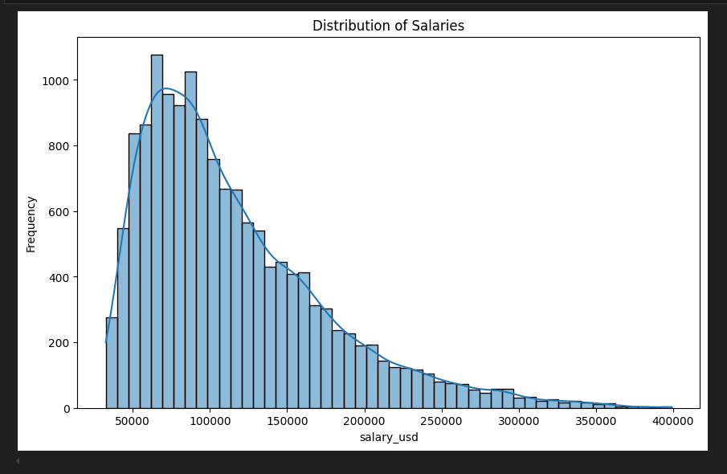
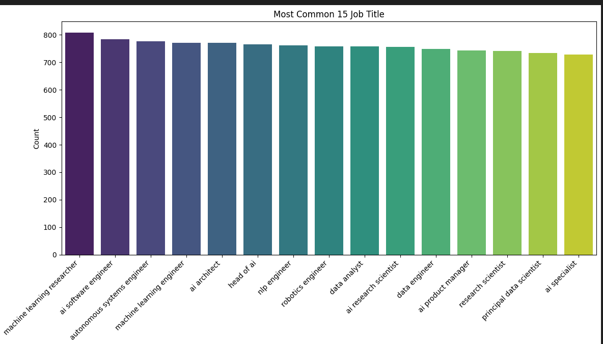
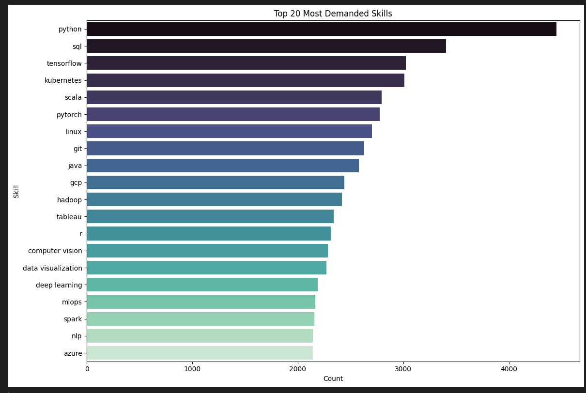

# Global AI Job Market & Salary Trends Analysis (2025)





## Project Overview

This project provides an in-depth analysis of the global Artificial Intelligence (AI) job market, focusing on trends in job availability, salary benchmarks, demanded skills, and industry distributions, with a hypothetical outlook towards 2025. **The analysis is based on the "Global AI Job Market and Salary Trends 2025" dataset sourced from Kaggle, provided by Bisma Sajjad.** The core objective is to extract actionable insights from this comprehensive dataset using Python for data processing and exploratory data analysis (EDA), and Power BI for interactive data visualization.

The analysis covers various facets of the AI job landscape, including:
*   Overall market size and average compensation.
*   Salary variations across different experience levels, job titles, and years of experience (YOE).
*   Geographical distribution of AI job opportunities.
*   Dominant industries hiring AI talent and popular employment types.
*   Most in-demand job titles and critical skills required by employers.

## Live Screenshots






## Key Insights Discovered

This analysis has uncovered several significant trends and patterns within the AI job market:

1.  **Market Size & Compensation:**
    *   The AI job market comprises approximately **15,000 listed positions** in this dataset.
    *   The overall average salary for AI professionals stands at around **$115,350 USD**.
    *   The salary distribution is right-skewed, indicating that while the average is high, a significant portion of salaries are concentrated below this average, with high earners pulling the average up.

2.  **Experience Pays:**
    *   There's a clear positive correlation between experience level and average salary. "Expert" level professionals command the highest average salaries (approx. **$188K**), significantly more than "Entry-Level" positions (approx. **$63K**).
    *   A similar trend is observed with Years of Experience (YOE), where salaries increase consistently with more years in the field, peaking around 15-20 years of experience.

3.  **Top Job Titles & Their Earning Potential:**
    *   The most common job titles include "Machine Learning Researcher," "AI Software Engineer," "Autonomous Systems Engineer," and "AI Architect," each with around 750-800 job listings.
    *   Specialized roles like "AI Specialist" and "Machine Learning ..." (e.g., Engineer/Scientist) show high average salaries, often exceeding **$120K**.

4.  **Geographical Hotspots:**
    *   AI job opportunities are globally distributed, with significant concentrations observed in **North America (especially the USA), Europe, and parts of Asia**. *(Refine with specific countries if your map or data allows for more detail)*.

5.  **Industry Demand & Employment Structure:**
    *   Key industries hiring AI talent include **Retail, Media, Technology, Healthcare, Consulting, and Automotive.** *(List more based on your treemap)*.
    *   **Full-Time employment is the dominant type** (approx. 25-26%), with Freelance, Contract, and Part-Time roles also making up significant portions of the market, indicating a diverse employment landscape.

6.  **Critical Skills for AI Professionals:**
    *   **Python** is overwhelmingly the most demanded skill, followed by **SQL** and **TensorFlow**.
    *   Other crucial skills include cloud platforms (e.g., **GCP, Azure**), big data technologies (**Hadoop, Spark**), containerization (**Kubernetes**), and specific AI/ML libraries/concepts (**PyTorch, Deep Learning, NLP, MLOps**).

## Dataset

*   **Source:** "Global AI Job Market and Salary Trends 2025" from Kaggle.
*   **Link:** [https://www.kaggle.com/datasets/bismasajjad/global-ai-job-market-and-salary-trends-2025](https://www.kaggle.com/datasets/bismasajjad/global-ai-job-market-and-salary-trends-2025)
*   **Description:** The dataset contains information on AI job titles, salaries (and currency), company locations, experience levels (abbreviated), required skills, industries, company sizes, and employment types.

## Methodology

The project followed a structured data analysis pipeline:

1.  **Data Ingestion & Preparation:**
    *   Raw data loaded from CSV.
    *   **Cleaning (`scripts/01_data_cleaning.py`):** Handled missing values (imputation or 'Unknown' where appropriate), corrected data types, standardized text fields (lowercase, whitespace stripping), and removed duplicate entries.
    *   **Transformation (`scripts/02_data_transformation.py`):**
        *   Converted salaries from various local currencies to a common currency (USD) using placeholder exchange rates for consistent comparison.
        *   Engineered new features such as `primary_skill` extraction and `salary_usd_bin` for binned analysis.
        *   Standardized column names (e.g., to lowercase and underscore_separated).
    *   Processed data saved to `data/processed/` for analysis and visualization.

2.  **Exploratory Data Analysis (EDA) (`notebooks/01_eda_ai_jobs.ipynb`):**
    *   Conducted univariate and bivariate analysis to understand distributions, relationships, and identify patterns in job titles, salaries, experience levels, locations, skills, and industries.
    *   Visualizations created using Matplotlib and Seaborn to illustrate findings (e.g., salary distributions, top skills, salary vs. experience).

3.  **Dashboard Development (Power BI):**
    *   The transformed dataset (`transformed_ai_jobs_data.csv`) was imported into Power BI.
    *   Further transformations performed in Power Query Editor, such as mapping abbreviated `experience_level` and `employment_type` values to their full descriptive names for better readability.
    *   An interactive multi-page dashboard was created to visualize key metrics and insights, including:
        *   KPIs for total jobs and average salary.
        *   Breakdowns by experience level, employment type, industry, and job title.
        *   Geographical job distribution map.
        *   Salary trends and distributions.
        *   Slicers for dynamic filtering by location, industry, etc.


## Technologies Used

*   **Programming Language:** Python 3.x
*   **Data Manipulation & Analysis:** Pandas, NumPy
*   **Data Visualization (Python):** Matplotlib, Seaborn
*   **Interactive Dashboarding:** Microsoft Power BI
*   **IDE/Editors:** Jupyter Lab/Notebook, VS Code
*   **Version Control:** Git, GitHub

## Setup and Installation

1.  **Clone the repository:**
    ```bash
    git clone https://github.com/cfmoreno/ai-job-market-analysis.git
    cd ai-job-market-analysis
    ```

2.  **Create and activate a Python virtual environment:**
    ```bash
    python -m venv venv
    # Windows
    # venv\Scripts\activate
    # macOS/Linux
    # source venv/bin/activate
    ```

3.  **Install dependencies:**
    ```bash
    pip install -r requirements.txt
    ```

## Usage

1.  **Run Data Processing Scripts:**
    Execute the Python scripts in order from the project root directory:
    ```bash
    python scripts/01_data_cleaning.py
    python scripts/02_data_transformation.py
    ```
    This will generate the processed CSV files in the `data/processed/` directory.

2.  **Explore EDA Notebook:**
    Launch Jupyter Lab/Notebook and open `notebooks/01_eda_ai_jobs.ipynb` to view the exploratory data analysis steps and preliminary visualizations.
    ```bash
    jupyter lab # or jupyter notebook
    ```

3.  **View Power BI Dashboard:**
    *   Ensure you have Microsoft Power BI Desktop installed.
    *   Open the `powerbi/ai_jobs_dashboard.pbix` file.
    *   The dashboard connects to `data/processed/transformed_ai_jobs_data.csv`. If prompted, ensure the data source path is correctly set.

## Future Work & Potential Enhancements

*   **Advanced Salary Prediction Model:** Develop a machine learning model to predict AI salaries based on features like experience, location, skills, and industry.
*   **Real-time Data Integration:** Incorporate an API to fetch more current job listings or exchange rates.
*   **Text Analysis on Job Descriptions:** Perform NLP on job descriptions to extract more nuanced skill requirements or identify emerging trends.
*   **Detailed Skill-Salary Correlation:** Analyze the impact of specific skill combinations on salary levels.
*   **Deployment:** Publish the Power BI dashboard to the Power BI service for wider accessibility.

## License

This project is licensed under the MIT License - see the [LICENSE](LICENSE) file for details.
